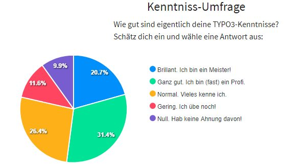
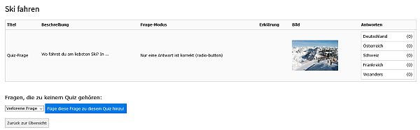

.. ==================================================
.. FOR YOUR INFORMATION
.. --------------------------------------------------
.. -*- coding: utf-8 -*- with BOM.

.. include:: ../Includes.txt

.. _introduction:

Introduction
============

.. _what-it-does:

What does it do?
----------------

An extension that offers Quiz, Tests and Polls. You can configure, which results should be shown. An evaluation is possible too.
Automatic deletion of quiz takers via task possible.

Question types/modes: radio-box, checkbox, select-box, yes/no, text-field, textarea, star-rating.

Avaiable languages: english and german.

You will find some examples on my homepage: `quizpalme.de <http://www.quizpalme.de/quiz-umfrage>`_

.. _screenshots:

Screenshots
-----------

Here you find 4 examples and 2 more screenshots are in the user manual.

.. figure:: ../Images/QuizExample.jpg
   :width: 400px
   :alt: A basic quiz

   This screenshot shows a basic quiz.

   This screenshot shows a poll result as a chart.

   This screenshot shows a poll in the backend module.

.. figure:: ../Images/BackendExample.jpg
   :width: 600px
   :alt: A chart example

   This screenshot shows a chart in the backend.

Thanks to the
-------------

`fixpunkt werbeagentur gmbh, Bonn <https://www.fixpunkt.com/webentwicklung/typo3/>`_
for giving me the possibility to realize (partly)
`this extension <https://www.fixpunkt.com/webentwicklung/typo3/typo3-extensions/>`_
and share it with the TYPO3 community.
