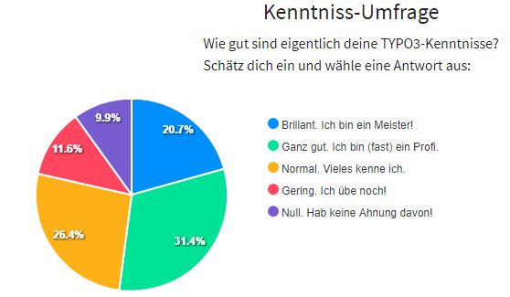
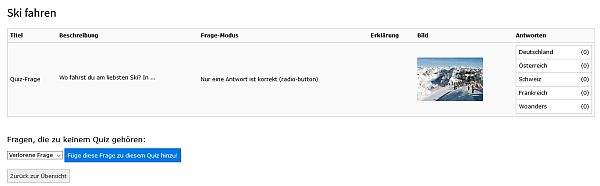
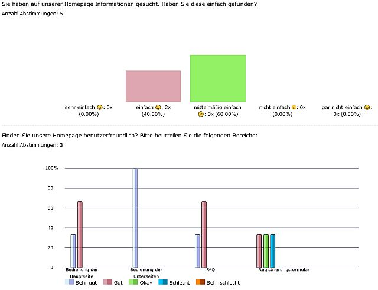

.. ==================================================
.. FOR YOUR INFORMATION
.. --------------------------------------------------
.. -*- coding: utf-8 -*- with BOM.

.. include:: ../../Includes.txt

.. _introduction:

Einleitung
==========

.. _what-it-does:

Was macht die Extension?
------------------------

Eine moderne Extension für Quizze, Umfragen und Tests. Man kann konfigurieren,
welche Ergebnisse angezeigt werden sollen. Ergebnisse können auch als Chart
angezeigt werden. Eine Auswertung des Ergebnisses ist auch möglich.
Automatische Löschung der Teilnehmerdaten via Task möglich.
Ajax-Version auch vorhanden.

Frage-Typen: Radio-Box, Check-Box, Auswahl-Box, ja/nein, Text-Zeile, Text-Box,
Sterne, Matrix (nur für Umfragen und ohne genaue Auswertung).

Tags können benutzt werden um Fragen zu gruppieren nach Rahmen oder Seiten.

jQuery wird benötigt. Optimiert für Bootstrap 4.
2 Widgets für das Dashboard vorhanden.

Verfügbare Sprachen: englisch und deutsch.

Es ist der Nachfolger von myquizpoll.

Man findet zahlreiche Beispiele auf meiner Homepage:
`quizpalme.de <https://www.quizpalme.de/quiz-umfrage>`_

.. _screenshots:

Screenshots
-----------

Hier sieht man 4 Beispiele und weitere 2 sind im Benutzerhandbuch.

.. figure:: ../../Images/QuizExample.jpg
   :width: 400px
   :alt: Ein einfaches Quiz

   Ein einfaches Quiz.

   Dieser Screenshot zeigt ein Umfrage-Ergebnis als Chart.

   Dieser Screenshot zeigt eine Umfrage im Backend-Modul.

   Dieser Screenshot zeigt ein Chart im Backend-Modul.

Danke an...
-----------

Diese Extension wurde programmiert von der
`fixpunkt für digitales GmbH, Bonn <https://www.fixpunkt.com/webentwicklung/typo3/typo3-extensions/>`_
und fixpunkt stellt sie der TYPO3-Community zur Verfügung.
