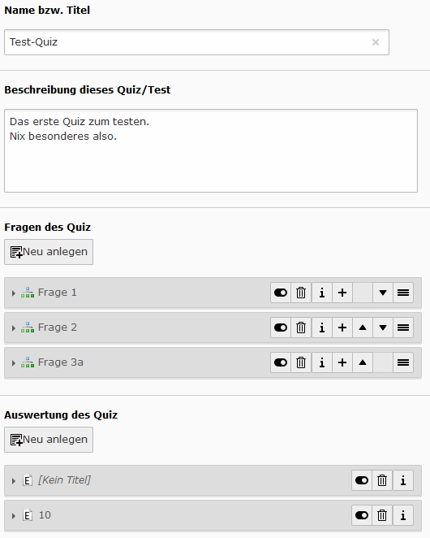
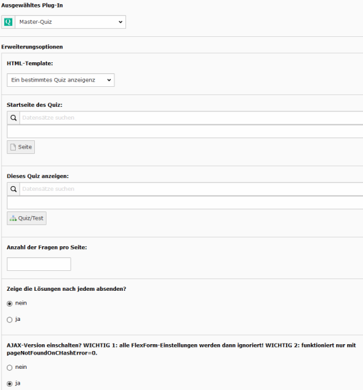
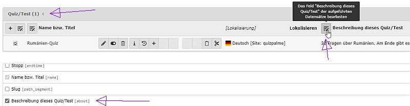

.. ==================================================
.. FOR YOUR INFORMATION
.. --------------------------------------------------
.. -*- coding: utf-8 -*- with BOM.

.. include:: ../Includes.txt

.. _user-manual:

Users Manual
============

Editors can create a quiz/poll/test on a folder. First you must create a quiz in the list view. Click at the quiz and add some questions and answers to the quiz.
Optionally you can add some evaluations.

After you have created a quiz with some questions you can add the plugin at a page and there you must select the folder with the quiz.

- Note:

  - Not every setting can be done by FlexForms. There are more TypoScript-settings.

  - When you enable the AJAX-version, the FlexForms will be ignored, because the AJAX-call does not know the plugin.

  - **Configure the quiz only by TypoScript, if you use the AJAX-version**.

  - The AJAX-call calls an normal action and not an eID-script. The cHash-check must be disabled (this is set by default) if you use AJAX.

  - The AJAX-solution is currently not working then using the action "show by tag".

.. tip::

   If you have a quiz with more than 10 questions, the backend will be very slow. To avoid this, create a quiz with nearly empty questions.
   Finally edit every question individually.
   Second possibility: go to the backend module and click on "Show quiz properties".
   There you could add questions to a quiz after you have created questions first.
   Third possibility: you can use the "Extended view" ("Erweitere Ansicht") in the list view. There you could edit every field of a quiz
   after you have created the whole quiz/poll. See screenshot below.

This screenshots shows you a quiz in the list view and some FlexForm-settings of the plugin.

   Backend view of a quiz.

   Backend view of the plugin (early beta version).

   You can edit every field of a quiz in the extended view.

Actions
-------

You can select in the plugin-configuration via FlexForms between this actions:

- List of all quiz/poll/test of one folder with links to the single view

- Show a selected quiz/poll/test and use a pagebrowser

- Show a selected quiz/poll/test and order the questions by tag: on each page will be shown questions of one tag
  (Ajax-version is not working yet).

- Show an intro page and then a quiz.

- Show a result of a quiz/poll/test

- Show a highscore of a quiz

Question modes
--------------

You can choose between the following question modes:
Multiple answers possible (check-box), Choose one answer (radio-button), Select one answer (select-options),
Enter an answer (text-field), Yes/no-boxes (2 radio-buttons), Enter a comment (textarea), Show a comment, Star rating.

Time period
-----------

A time period can be defined at a quiz and at a tag. When the time is up, the form will be send to the next page or to the final page.

Points
------

There is no checkbox for correct answers! To check a answer as correct, you need to set a value greater than 0 at the points-field.
You can set 0 or a negative value for wrong answers.
You don´t need to set points for polls.

Text-Answers
------------

There are 2 possible text answers: input-field or textarea.
*Note*: this feature works only, if you add one answer to such a question too! Your added answer is not shown in the frontend, but it is needed to show
a input-field or textarea in the frontend.

Star-Rating
-----------

A special case is the star rating feature. For that feature a CSS-file is included by default. If you do not need this feature, you can remove the CSS-file like this::

  page.includeCSS.fpMasterQuizRatingStar >

Otherwise you should know this: the star rating may not work correct with old browsers. It is a CSS only solution. It looks like this:

.. figure:: ../Images/UserManual/StarRating.png
   :width: 164px
   :alt: Star rating

   Star rating example.

You can use it this way: because it uses radio-boxes in the background, you must configure it like radio-boxes.
Select the question mode "star rating" and than add as many answers as you like to have stars. If you want 5 stars, add 5 answers.
The first answer is the highest rating (e.g. 5 stars) and and last answer is the lowest answer (1 star). 
That is the opposite logic of the star rating in the extension myquizpoll.
Do not set the points. In the user-answer, the points shows how many stars were seleced.
With the setting checkAllStars you can define if one or all stars should be checked by default.

.. important::

   For every question you need to add at least one answer, even for some types the answer is not displayed!

.. _user-faq:

FAQ
---

- I need some features from myquizpoll. What can I do?

  You can tell me, which feature you need.

- What about user data like name and email? Where can we ask for them?

  There is a special intro-page possible, where you can ask for the user-name, email and homepage.
  Or you can ask for the user data at the first page of a quiz. Todo: ask for user data at the final page.
  If the user is logged in, this data will be taken from fe_users.

- There are some errors or I get a blank page. What can I do?

  If you use AJAX: disable it or read the Administration-manual. You can try this TypoScript too: config.contentObjectExceptionHandler = 0
